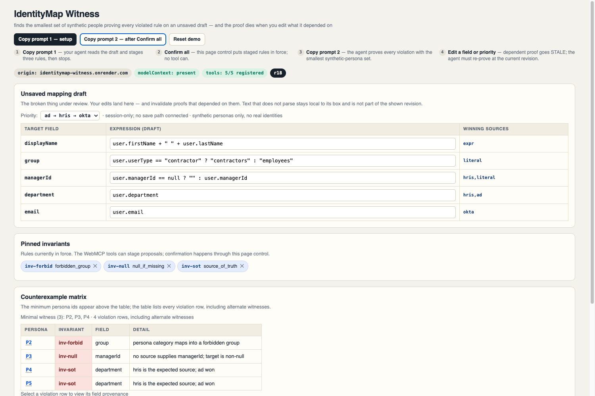

# IdentityMap Witness

Identity teams merge employee records from Active Directory, HR systems, and
identity providers before those profiles drive access. A subtle mapping mistake can
give a contractor employee permissions, erase a manager relationship, or let stale
directory data override HR.

Two concessions first: unsaved-draft preview already exists as a first-party
product pattern, and another page-local agent with the same state and rules could
run the same deterministic engine. What this entry adds is the page-authored safety
contract and an evidence lifecycle that makes old proof expire.

> Catch identity-mapping mistakes before they go live. A WebMCP agent proves every broken rule with the fewest synthetic test users, then rechecks every edit while a human keeps control.

IdentityMap Witness is a WebMCP-powered workbench for reviewing that unsaved draft.
A human confirms the safety rules; five page-authored `document.modelContext` tools
let an agent inspect the current revision, find the smallest synthetic test set
that exposes every violation, explain source provenance, preview identity-minimized fixes,
and prepare a review packet only from fresh evidence. Every relevant edit makes
dependent proof stale. No WebMCP tool can save or apply changes.



*Page tagline: finds the smallest set of synthetic people proving every violated
rule on an unsaved draft — and the proof dies when you edit what it depended on.*

**Live demo:** https://identitymap-witness.onrender.com

## Evidence

- [`data/oracle.json`](data/oracle.json) is human-audited. Commit `a575653` carries
  the required `Oracle-Audited: yes` trailer.
- The committed eval bundle contains [`eval/out/report.json`](eval/out/report.json)
  and its HEAD-bound `relay-<sha>.json` trace. The report's `sha` field names the
  commit it was produced from and identifies the paired relay trace. Both
  regenerate with `node eval/run.mjs`.
- `npm test`: **292 tests, 292 passed, 0 failed, 0 skipped**.
- No coverage percentage is claimed.

## Two-phase judge path

The first-screen action bar offers two independently labeled copy buttons with the
exact evaluated prompts, a visible polite live-region copy result, and the
**Reset demo** control, which only reloads the page.

1. **Copy prompt 1 — setup.** The agent reads the session and stages exactly three
   invariants. Staging creates pending cards but does not change the confirmed pins
   or revision. The agent must stop at r17.
2. **Human Confirm all.** The human reviews the pending rule text, version, and
   content fingerprint, then clicks the page's real Confirm control. That
   version-bound click confirms the rules and advances to r18.
3. **Copy prompt 2 — after Confirm all.** The agent must re-read the now-confirmed
   session before finding witnesses. Every human grid or priority edit invalidates
   dependent evidence; after each edit the agent re-reads/re-finds at the current
   revision and prepares only from fresh evidence ids.

Apply remains a manual page control, is not exposed as a WebMCP tool, and is outside
the demo path.

## Five WebMCP tools

| tool | authority |
|---|---|
| `read_mapping_session` | Read current draft expressions, confirmed rule ids, pending state, and revision; returns no profile values. |
| `stage_mapping_invariants` | Stage canonical pending rules for human review; it cannot confirm them. |
| `find_mapping_counterexample` | Exhaustively find a minimal synthetic witness against confirmed rules. |
| `preview_mapping_patch` | Preview a redacted patch without mutating the draft. |
| `prepare_mapping_review` | Build a packet from fresh evidence; coverage and blockers show whether it is complete, and only a fresh blocker-free packet turns GREEN. |

## How WebMCP is wired

The production registration leaf is [`app.js:534–540`](app.js#L534-L540):

```js
    (definition, options) => document.modelContext.registerTool({
      name: definition.name,
      description: definition.description,
      inputSchema: definition.inputSchema,
      execute: definition.execute,
      annotations: definition.annotations,
    }, options),
```

When WebMCP and the demo data are available, the page attempts each of the five
registrations once during initialization; state changes do not re-register them
because their `execute` closures read the current store, and relevant edits make
dependent evidence stale.

## Run locally

Node 21 or newer is required because the Chrome relay uses the native WebSocket
client.

```bash
git clone https://github.com/Caleb0796/identitymap-witness.git
cd identitymap-witness
npm test
node harness/serve.mjs  # `npm run serve` is equivalent
```

With the server running, launch Chrome 152 in a fresh profile with WebMCP enabled:

```bash
imw_profile_dir="$(mktemp -d)"
"/Applications/Google Chrome.app/Contents/MacOS/Google Chrome" \
  --user-data-dir="$imw_profile_dir" \
  --enable-features=WebMCP \
  http://127.0.0.1:4173
```

### Judge path (ChatGPT built-in browser)

- Open ChatGPT's built-in browser and enable site tools for this site.
- Navigate to the full `https://identitymap-witness.onrender.com` URL and pass the
  visible consent gate.
- Use **Copy prompt 1 — setup**, send it, and review the pending cards.
- Click **Confirm all**, then use **Copy prompt 2 — after Confirm all** and send it.

Run all executable gates from the repository root:

```bash
npm test
node harness/relay.mjs --smoke  # Chrome 152, three fresh cold profiles
node harness/relay.mjs --e2e    # 12 rounds of real DOM events and recovery
node eval/run.mjs               # thresholds, oracle binding, write oracle
```

## Scope and evidence honesty

Unsaved-draft preview is already a first-party product pattern, and another
page-local agent with the same state and rules could run the same deterministic
engine. The evaluated contribution is the page-authored safety workflow and its
evidence lifecycle, not uniqueness or an impossibility result.

The fixture has eight synthetic personas. State is tab-local; the witness search is
exhaustive only at this fixture's scale; no real identity provider or save path is
connected. FNV-1a fingerprints identify visible canonical content but are not
cryptographic signatures. Browser-Use and Full-CDP comparisons are designed, not
run. The persisted-state API comparison is a by-construction ablation, not a
competitive benchmark.

Privacy claims are deliberately exact: `CANARY_` is a synthetic test tripwire, not
a general PII detector. Tool output minimizes `firstName`, `lastName`, `email`,
`displayName`, and `managerId` diffs and never embeds raw invariant values in
violation details. A browser agent or extension with general page-control authority
may still click manual DOM controls; a future privileged deployment would require
browser-mediated or out-of-band authorization, not a “human-only” label.

Read the exact contract in [`SPEC.md`](SPEC.md), the reproducible gates in
[`EVAL.md`](EVAL.md), and the oracle derivation in
[`data/golden-walk.md`](data/golden-walk.md).
